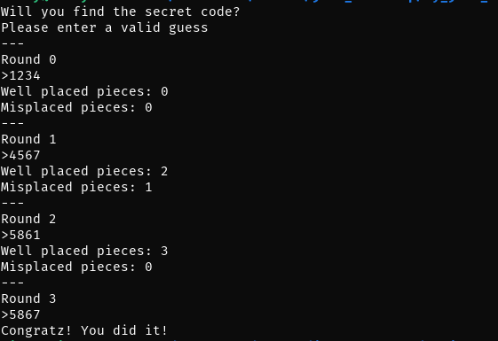
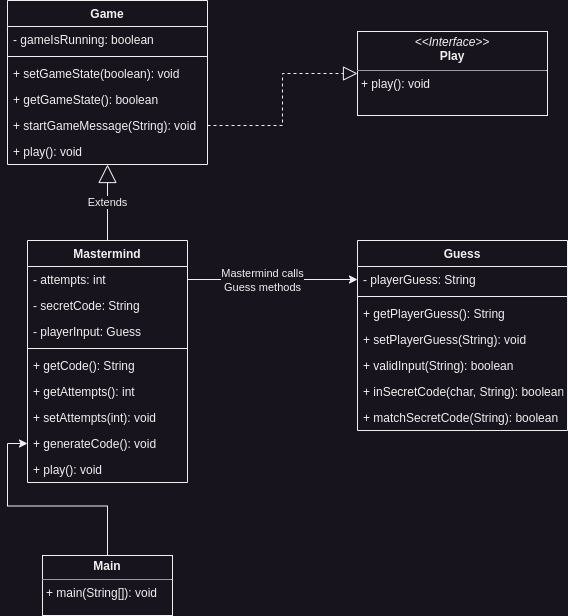

# Mastermind Game
***

## Summary 
This project is a Mastermind game implemented in the Java programming language. The objective of this game is to guess a 4 digit code. The 4 digit code is composed of unique, non-repeating numbers from 0 to 8. When the player makes a guess, the player receives feedback in the form of two numbers, the number of correct digits in the right position and the number of correct digits but in the wrong position. 

## Design 
The program utilizes object oriented programming principles, such as inheritance,
encapsulation, and polymorphism.
The Mastermind game program is composed of 5 classes: Game, Guess, Main, Mastermind, Guess, Play. The class diagram below shows the relationship among those classes

## Installation
The program can be compiled using ``javac`` and the following java files:

* Main
* Mastermind
* Guess
* Game
* Play

## Usage
To run the program, the following CLI commands can be used to start the game:

* `java Main` - This starts the game with a randomly generated code and 10 attempts
* ` java Main -c <code> -t <attempts> ` - This starts the game with user specified code and attempts
* `java Main -c <code> ` *or* `java Main -t <attempts>` - These commands can omit either user specified code or attempts, and the omitted parameter will initialize to its default value
